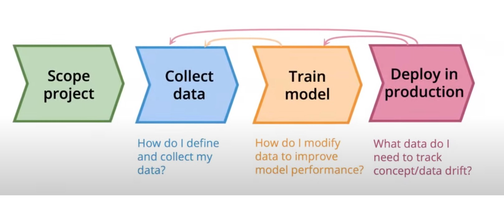

# Andrew Ng - MLOps: From a Model Centric to Data Centric approach
* Presentation: https://www.youtube.com/watch?v=06-AZXmwHjo
* Panel discussion: https://youtu.be/Yqj7Kyjznh4?t=750

## MLOps
* An emerging discipline that tries to make development and deployment of machine learning systematic
* Most important function: Ensuring consistently high quality data, throughout the machine learning project life cycle cycle
    
* Who should be involved? ML engineer, data scientists, domain experts

## From Big Data to Good Data
* Smaller datasets are more susceptable to data inconsistency and noise. There is significant opportunity for improvement in problems with <10k examples via cleaning up noise and/or collecting more labels
* ***BUT Big data problems where there is a long tail of rare events in the input are also small data problems***

* Need a `systematic approach, with tools and processes` to ensure high quality data througout the ML project lifecycle
* Good data is:
    * Defined consistently (definition of labels y is unambiguous)
    * Cover important cases (good coverage of inputs x). Includes bias and fairness considerations
    * Has timely feedback from production data (distribution covers data drift and concept drift)
    * Sized appropriately

## Data Centric AI
* `AI system = Code + Data`
* MLOps' most important task is to make high quality data available throug all stages of the ML project lifecycle

| Model-centric AI | Data-centric AI |
|---|---|
| Collect what data you can, and develop a model good enough to deal with the noise in the data | Consistency of the data is paramount. Systematically use tools and processes to imporve data quality |
| Hold the data fixed and iteratively improve the code | Hold the code fixed and iteratively improve the data |
|  |  |

* important frontier - MLOps tools to make data-centric AI an efficient and systematic process

## How do we systematically improve data consistency? 
* High level process to iteratively improve the data:
    1. Train a model
    2. `Error analysis` to identify the tyhpes of data the algorithm does poorly on (e.g. speech with car noise)
    3. Either:
        1. obtain `more data` via data augmentation, data generation or data collection (change inputs x) or
        2. give a `more consistent definition for labels` if they were found to be ambiguous (change labels y)
    4. Post-deployment monitoring:
        1. systematically check for concept drift/data drift
        2. flow data back to retrain/update model regularly
* Approaches for a `more consistent definition for labels`: 
    1. Ask 2 independent labllers to label a sample of observations
    2. Measure consistency between labellers to discover where they disagree
    3. For classes where labellers disagree, revise labelling insturctions until label allocation becomse consistent. E.g. illustrate labelling instructions with examples of examples of concept, borderline cases and other confusing examples

## Andrew's tips for Data-centric AI development
1. Make the labels (y) consistent
2. Use multiple labellers to spot inconsistencies
3. Clarify labelling instructions by tracking down ambiguous examples
4. Toss out noisy examples. More data is not always better
5. Use error analysis to focus on subset of data to improve
