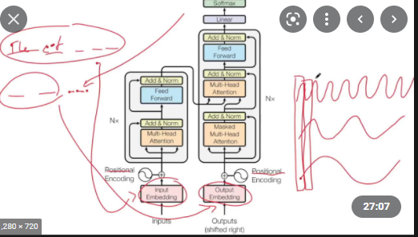

# Attention is all you need - Sequence to Sequence models
## Yannik Kilcher video on Google Paper
https://images.app.goo.gl/DQgE2mZ4D69zALZR7

* Positional Encoding: uses multiple sine waves of different frequencies. Word sentence is placed on the x-axis and the position of each word is encoded according to it's place on each of the sine waves. In this fashion, the relative position of each word can be represented as the combined position on each sine wave
* For NLP attention, the entire source sample (sentence) is encoded at once rather than a sequence. Then the decoder takes in the first n tokens of the target sentence and predicts the n+1 word
* Links between encoder and decoder are in the form of key, value, query
    * encoder (source sentence) creates key value pairs. values are vectors, keys are a way of indexing values. Encoder discovers interesting thing about the sentence and stores them as the values
    * decoder builds query. "I would like to know attributes about ..."
    * dot product applied between value, key and query and most similar (largest value) is returned as the prediction
* Why is it better than RNNs? Lower computation because of shorter path lengths
    * Encoder doesn't need to memorise entire sentence and sequence in order to decode (unlike RNNs)
    * So seq-to-seq is better for longer translation tasks

## Illustrated Transformer
https://jalammar.github.io/illustrated-transformer/